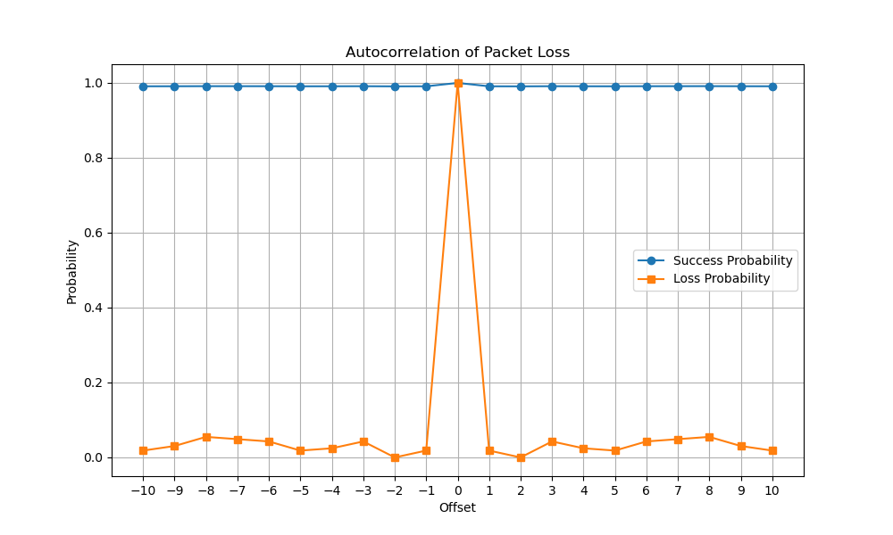
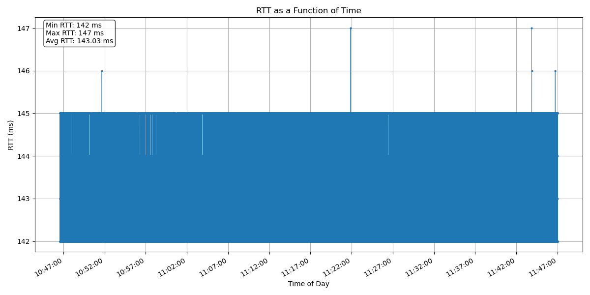
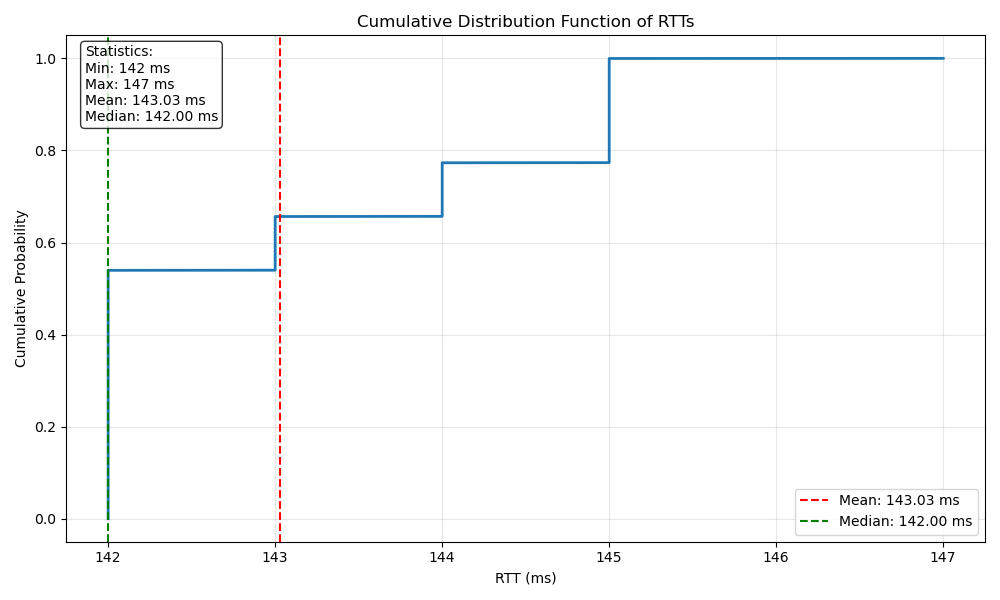
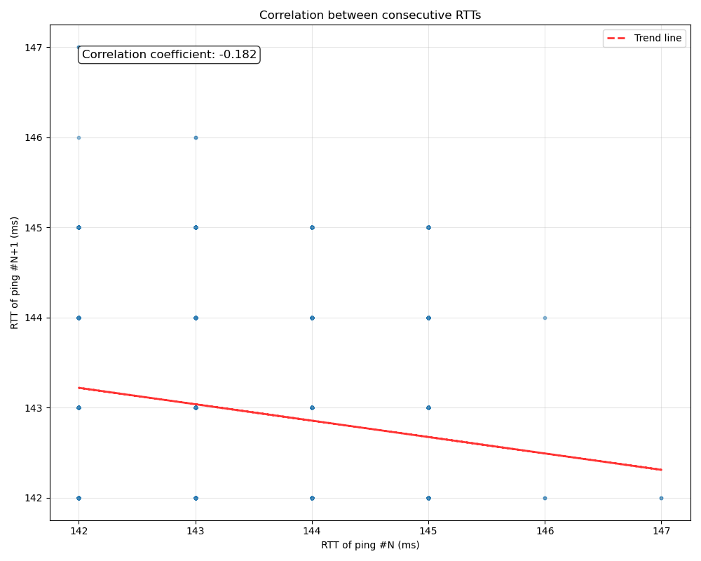
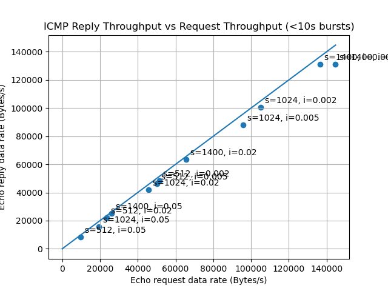

# CS144 check4报告

### 1.What was the overall delivery rate over the entire interval? In other words: how many echo replies were received, divided by how many echo requests were sent?

```bash
(base) louxu@InvisibleRAT check4 % grep "time=" data.txt | wc -l
   17939
```

总发送数：18103

17939/18103 * 100% = 99.09%

### 2.What was the longest consecutive string of successful pings (all replied-to in a row)?

```python
import re

def count_icmp_seq(file_path):
    icmp_seq_list = []

    with open(file_path, 'r') as file:
        for line in file:
            match = re.search(r'icmp_seq=(\d+)', line)
            if match:
                icmp_seq = int(match.group(1))
                icmp_seq_list.append(icmp_seq)

    total_count = len(icmp_seq_list)
    min_seq = min(icmp_seq_list) if icmp_seq_list else None
    max_seq = max(icmp_seq_list) if icmp_seq_list else None

    missing_seq = []
    if icmp_seq_list:
        for i in range(min_seq, max_seq + 1):
            if i not in icmp_seq_list:
                missing_seq.append(i)

    return {
        'total_count': total_count,
        'min_seq': min_seq,
        'max_seq': max_seq,
        'missing_seq': missing_seq,
        'all_seq': sorted(icmp_seq_list)
    }

def longest_consecutive_pings(missing_seq):
    res = 0
    for i, j in zip(missing_seq, missing_seq[1:]):
        res = max(res, j - i)
    return res

file_path = 'data.txt'
result = count_icmp_seq(file_path)

print(f'最长连续ping数：{longest_consecutive_pings(result["missing_seq"])}')
```

最长连续ping数：1484

### 3.What was the longest burst of losses?

```python
def longest_losses(missing_seq):
    res = 0
    for i in missing_seq:
        if i - 1 in missing_seq:
            continue
        j = i
        len = 1
        while j + 1 in missing_seq:
            len += 1
            j += 1
        res = max(res, len)
    return res
```

最长连续丢包数：2

### 4.Produce a graph showing the autocorrelation of “packet loss” over time.

```python
def autocorrelation_of_packet_loss(icmp_seq, missing_seq, k):
    missing_set = set(missing_seq)
    received_set = set(icmp_seq)
    max_seq = max(icmp_seq + missing_seq)

    success_k = [0] * (2 * k + 1)
    loss_k = [0] * (2 * k + 1)

    for i in icmp_seq:
        if i <= k or i > max_seq - k:
            continue
        for j in range(-k, k + 1):
            if (i + j) in received_set:
                success_k[j + k] += 1

    for i in missing_seq:
        if i <= k or i > max_seq - k:
            continue
        for j in range(-k, k + 1):
            if (i + j) in missing_set:
                loss_k[j + k] += 1

    success_prob = [count / success_k[k] if success_k[k] > 0 else 0 for count in success_k]
    loss_prob = [count / loss_k[k] if loss_k[k] > 0 else 0 for count in loss_k]

    return success_prob, loss_prob

def plot_probabilities(success_prob, loss_prob, k):
    x_values = list(range(-k, k + 1))

    plt.figure(figsize=(10, 6))

    plt.plot(x_values, success_prob, label='Success Probability', marker='o')
    plt.plot(x_values, loss_prob, label='Loss Probability', marker='s')

    plt.xlabel('Offset')
    plt.ylabel('Probability')
    plt.title('Autocorrelation of Packet Loss')
    plt.legend()
    plt.grid(True)
    plt.xticks(x_values)

    plt.show()
```



当一个ping成功接收，除了与它间隔1个的ping交付率低于平均交付率，其它附近的ping均略高于平均交付率。

当一个ping接收失败，与它间隔的2个ping的失败率大幅减少。从第3个开始恢复波动，独立于当前ping。


### 5.What was the minimum RTT seen over the entire interval?

```python
import re

def extract_time_values(file_path):
    RTT = []
    
    with open(file_path, 'r') as file:
        for line in file:
            match = re.search(r'time=(\d+) ms', line)
            if match:
                time_value = int(match.group(1))
                RTT.append(time_value)
    
    return RTT

file_path = 'data.txt'
RTT = extract_time_values(file_path)

print(f'minimun RTT: {min(RTT)} ms')
```

minimun RTT: 142 ms

### 6.What was the maximum RTT seen over the entire interval?

```python
print(f'maximum RTT: {max(RTT)} ms')
```

maximum RTT: 147 ms

### 7.Make a graph of the RTT as a function of time. Label the x-axis with the actual time of day (covering the hour+ period), and the y-axis should be the number of milliseconds of RTT.

```python
import re
import datetime
import matplotlib.pyplot as plt
import matplotlib.dates as mdates

def extract_time_values(file_path):
    timestamps = []
    RTTs = []

    with open(file_path, 'r') as file:
        for line in file:
            timestamp_match = re.search(r'\[(\d+\.\d+)\]', line)
            rtt_match = re.search(r'time=(\d+) ms', line)

            if timestamp_match and rtt_match:
                timestamp = float(timestamp_match.group(1))
                rtt = int(rtt_match.group(1))

                timestamps.append(timestamp)
                RTTs.append(rtt)

    return timestamps, RTTs

def convert_timestamp_to_datetime(timestamp):
    return datetime.datetime.fromtimestamp(timestamp)

file_path = 'data.txt'
timestamps, RTTs = extract_time_values(file_path)

datetimes = [convert_timestamp_to_datetime(ts) for ts in timestamps]

plt.figure(figsize=(12, 6))
plt.plot(datetimes, RTTs, marker='o', linestyle='-', markersize=2, linewidth=0.5)
plt.xlabel('Time of Day')
plt.ylabel('RTT (ms)')
plt.title('RTT as a Function of Time')
plt.grid(True)

plt.gca().xaxis.set_major_formatter(mdates.DateFormatter('%H:%M:%S'))
plt.gca().xaxis.set_major_locator(mdates.MinuteLocator(interval=5))
plt.gcf().autofmt_xdate()

plt.text(0.02, 0.98, f'Min RTT: {min(RTTs)} ms\nMax RTT: {max(RTTs)} ms\nAvg RTT: {sum(RTTs)/len(RTTs):.2f} ms',
         transform=plt.gca().transAxes, verticalalignment='top',
         bbox=dict(boxstyle='round', facecolor='white', alpha=0.8))

plt.tight_layout()
plt.show()
```



### 8.Graph the Cumulative Distribution Function of the distribution of RTTs observed. This is a graph where the x-axis is each observed value of RTT, and the y-axis is the proportion of samples that were less than or equal to this number (so the y-axis will go from 0 to 1). What rough shape is the distribution?



RTT中位数小于平均值。说明大部分的RTT处于最低值142。但也有部分RTT处在较高值145-146，而处于中间值143-144的则较少。使得图像呈现中间低，两边高。

### 9.Make a scatter plot of the correlation between “RTT of ping #N” and “RTT of ping #N+1”. The x-axis should be the number of milliseconds from the first RTT, and the y-axis should be the number of milliseconds from the second RTT. How correlated is the RTT over time?



绘制散点图并拟合后，计算其相关系数仅为0.18。因此 ping #N 和 ping #N+1 并没有明显关系。

### 10.Do some brief (less than 10 seconds) experiments where you send a higher data rate of pings, by increasing the packet size and frequency.




packet size取1400，frequency 取 0.005时，吞吐量趋于平稳。此时的值为1400*473/4.921=134,566.145 Bytes/s

### 11.12.

省略（懒）


